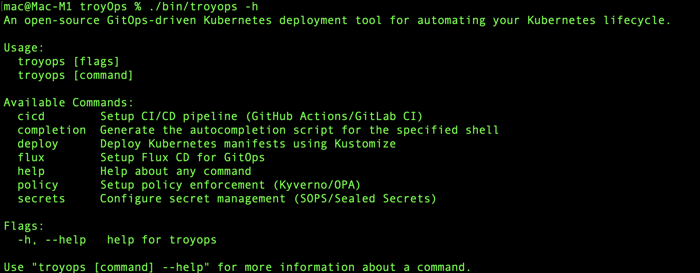

# **TroyOps**: GitOps-Driven Kubernetes Deployment

TroyOps is an open-source GitOps-driven Kubernetes deployment tool. It leverages Flux CD to automate the deployment of Kubernetes manifests, integrates CI/CD pipelines with GitHub Actions and GitLab CI, and supports multi-cluster environments. TroyOps also incorporates policy enforcement, secret management, and observability tools for a fully automated and secure deployment pipeline.



## **Key Features**

- **GitOps with Flux CD**: Automatically syncs Kubernetes manifests from Git repositories to Kubernetes clusters.
- **Multi-Cluster Support**: Manage and deploy to multiple Kubernetes clusters from a single Git repository.
- **Rollback Support**: Rollback failed deployments using Git history.
- **Drift Detection**: Alerts for configuration drift when the live Kubernetes configuration differs from the Git repository.
- **CI/CD Integration**: Use GitHub Actions or GitLab CI to automate the build and deployment pipeline.
- **Helm & Kustomize**: Manage Kubernetes resources with Helm charts or Kustomize templates.
- **Policy Enforcement**: Integration with Kyverno or OPA/Gatekeeper to enforce security and compliance policies.
- **Secret Management**: Integrates with SOPS or Sealed Secrets for encrypted secrets management.
- **Observability**: Built-in integration with SigNoz for monitoring and alerting.

## **Architecture Overview**

TroyOps follows the GitOps model, where all Kubernetes deployment manifests and configurations are stored in Git repositories. Flux CD ensures that the desired state defined in Git is continuously synced with the Kubernetes clusters.

The main components of TroyOps include:
- **GitHub/GitLab Repositories**: Store application manifests, Flux configuration, and CI/CD pipelines.
- **Flux CD**: Automates deployment and synchronization of Kubernetes resources.
- **CI/CD Pipelines**: Automates the build and deployment process using GitHub Actions/GitLab CI.
- **Helm/Kustomize**: Template Kubernetes manifests and manage environment-specific configurations.
- **Policy Enforcement**: Ensures compliance and security using Kyverno or OPA/Gatekeeper.
- **SigNoz**: Provides observability into the Kubernetes deployments with distributed tracing and metrics collection.
- **SOPS/Sealed Secrets**: Manages encrypted secrets within Git repositories.

### **Project Structure**

The project is structured to accommodate all the necessary components for a GitOps pipeline:

- **charts/**: Contains custom Helm charts for deploying TroyOps and applications.
- **kustomize/**: Holds Kustomize configurations for templating Kubernetes resources.
- **ci/**: Stores CI/CD configuration files for GitHub Actions/GitLab CI.
- **flux/**: Contains Flux CD configurations for synchronizing the Git state with the Kubernetes clusters.
- **policies/**: Holds policy enforcement configurations for Kyverno and OPA.
- **secrets/**: Contains secret management configurations using Sealed Secrets or SOPS.
  
### **Getting Started**

1. **Clone the Repository**:

   Clone the **TroyOps** repository to your local machine:

   ```bash
   git clone https://github.com/jefftrojan/troyops.git
   cd troyops

2. **Install Dependencies:**

Ensure that you have the following tools installed on your local machine:

- Flux CLI
- kubectl
- Helm
- SOPS
- Kustomize
- SigNoz
- Kyverno/OPA/Gatekeeper
- [GitHub Actions/GitLab CI](depending on your CI platform)

3. **Deploy to Kubernetes:**

- Set up Flux CD to manage your Kubernetes clusters and repositories.
- Apply Helm/Kustomize configurations for environment-specific deployments.
- Configure CI/CD pipelines (GitHub Actions/GitLab CI) for building and pushing container images.


4. **Secret Management:**

 If you are using SOPS or Sealed Secrets, ensure that your Kubernetes clusters have the necessary decryption keys available.

5. **Observability:**

Deploy SigNoz for distributed tracing and metrics collection. For additional monitoring, you may also integrate Prometheus and Grafana.

6. **Policy Enforcement:**

Apply Kyverno or OPA/Gatekeeper policies to enforce security and compliance across your Kubernetes clusters.

### Contributing

Contributions are welcome! Please open an issue or submit a pull request with your proposed changes.

**Issues:** Use the GitHub issues section for any bugs, enhancements, or questions.

**Pull Requests:** Ensure your code follows the existing style and includes appropriate tests or documentation.